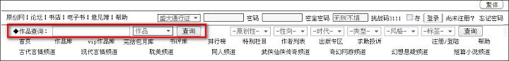
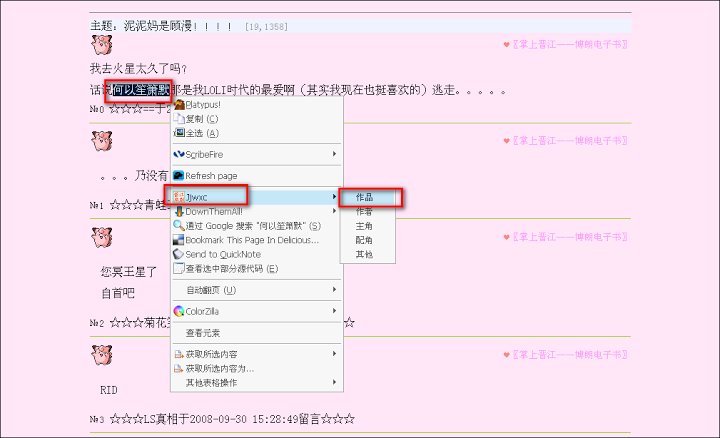
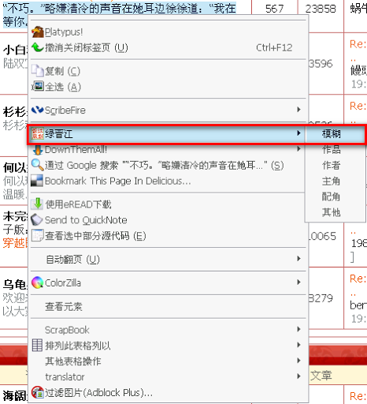

jjwxc
=====

功能：绿晋江http://www.jjwxc.net 网站小说的右键查询菜单

安装：https://addons.mozilla.org/zh-CN/firefox/addon/jjwxc/

说明：右键出现Jjwxc选单，可以直接在当前页面进行一键查询(作品，作者，主角，配角，其他关键字)小说。

调用haozi的Google自定义搜索引擎"小说drama"实现模糊查询，http://www.google.com/cse/home?cx=002715881505881904928:lxsfdlsvzng

==========
2008.12.30
 
与技术无关的说明：

囧，这玩意是昨晚被大神跟微微搞到热血沸腾想做个礼物出来的结果@@

写个firefox扩展(jjwxc.xpi)送给乌龟当新年礼物~~~

新年快乐！！！

==========
背景：

一般看荐书贴的时候，碰到没做链接的就要手动去绿晋江首页查。。。

这个东西就是让我们直接在当前网页中选中关键字(比如何以笙箫默)，然后在右键子菜单中选择Jjwxc子项中对应的关键字类型(比如书名)，点击，

那么就可以自动出现查询书名为何以笙箫默的结果页面

模糊查询：

